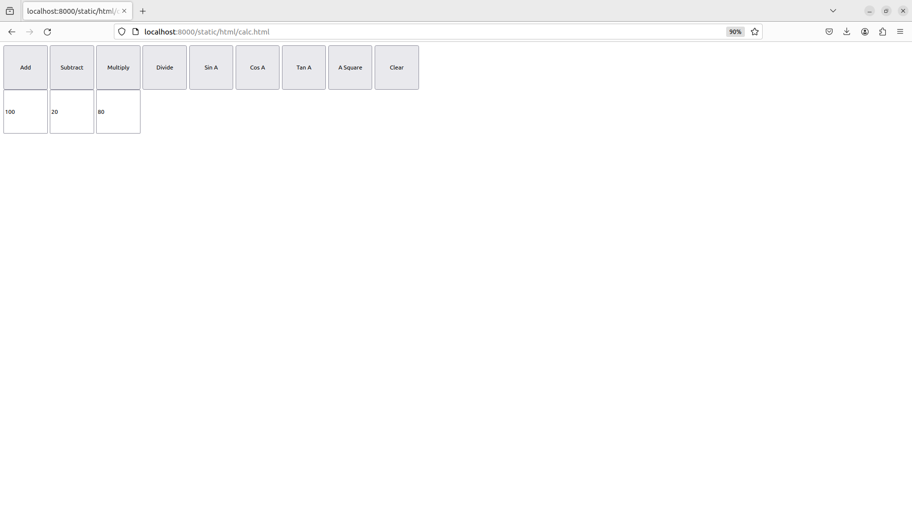

# Design of a Standard Calculator

## AIM:

To design a web application for a standard calculator.

## DESIGN STEPS:

### Step 1:
 
     Fork the github repository at https://github.com/gowriganeshns/standard-calculator

### Step 2:
     cd standard-calculator and then create a django project by typing:

     django-admin startproject myproj

### Step 3:
     
     go to settings.py under myproj/myproj and make the following changes

     1) in line 14, add import os

     2) under ALLOWED_HOSTS, include '*' in the list.

     3) at the end, in line 121, add the following code:
        
        STATICFILES_DIRS = [
            os.path.join(BASE_DIR,'static')
        ]

### Step 4:
     
     Now that we have made the changes, type the following commands to create a folder static, and then another folder html in it.

     (from standard-calculator/myproj)

     mkdir static
     cd static
     mkdir html
     cd html

### Step 5:
     
     create a html file under html folder

     touch calc.html

     now, add your code in the html file.

### Step 6:

Validate the HTML and CSS code.

### Step 7:

Publish the website in the given URL.

## PROGRAM :

### calc.html

    <html>
    <head>
    
    </head>
    <body>
    <form>
    <input type="button" style="height: 100px; width: 100px;" onclick="f1()" value="Add">
    <input type="button" style="height: 100px; width: 100px;" onclick="f2()" value="Subtract">
    <input type="button" style="height: 100px; width: 100px;" onclick="f3()" value="Multiply">
    <input type="button" style="height: 100px; width: 100px;" onclick="f4()" value="Divide">
    <input type="button" style="height: 100px; width: 100px;" onclick="f5()" value="Sin A">
    <input type="button" style="height: 100px; width: 100px;" onclick="f6()" value="Cos A">
    <input type="button" style="height: 100px; width: 100px;" onclick="f7()" value="Tan A">
    <input type="button" style="height: 100px; width: 100px;" onclick="f8()" value="A Square">
    <input type="button" style="height: 100px; width: 100px;" onclick="f9()" value="Clear">
     
    <input type="text" style="height: 100px; width: 100px;" id="n1">
    <input type="text" style="height: 100px; width: 100px;" id="n2">
    <input type="text" style="height: 100px; width: 100px;" id="n3">
    </form>
    </body>
    </html>

## OUTPUT:

### Functioning of the calculator

## Result:

     We have now succesfully created a standard calculator

